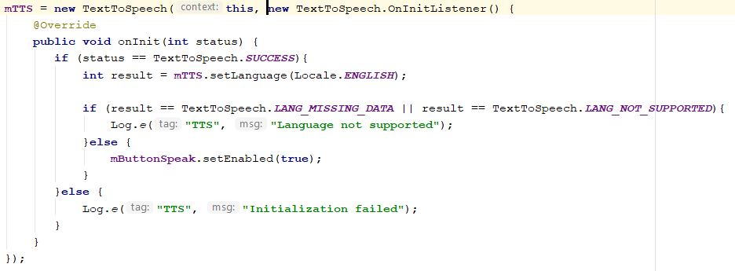

# Text-to-speech-convert

Here we simply convert any text to speech and we can also change the pitch and speed of the speech

## Dependency

for material text design, we simple add material dependency in `build.gradle` **App** module 

and add **maven** in `build.gradle` **Project**
module

## Getting Started

In **XML** file we need to add `TextView` for entering the text, here material textview is used

for changing the **pitch** of the voice `SeekBar` is used

and for changing the **speed** of the voice also `SeekBar` is used

and used a `Button` to hear the voice

In **JAVA** file, first we used `TextToSpeech` property to convert the text to speech and as per your requirement you can change the 
**LOCAL** language. Here by default, **ENGLISH** is used to speech

Then create a funtion where *pitch* and *speed* limits are set and call the **TextToSpeech** and also set the pitch and speed variables with 
it.

After that, when **SPEAK IT** button clicked *speak* function called.

## Want to hear that

https://github.com/barmangolap15/Text-to-speech-convert/blob/master/texttospeech/20200423-234133-480x1028.mp4

